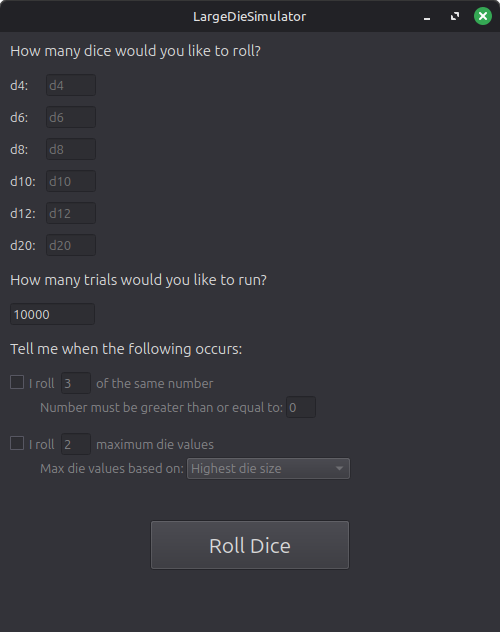

# LargeDieSimulator
For rolling very large amounts of very specific die with customizable conditions

## About
LargeDieSimulator is a C++/Qt 6 application intended for situations where manually calculating probabilities becomes impractical. The goal is to provide a flexible tool for exploring complex dice scenarios through large-scale simulation.

## Current Status
**Work in progress**

The GUI framework is in place, but the backend logic has not yet been connected. That being said, most of the core functionality is available through the command line.

